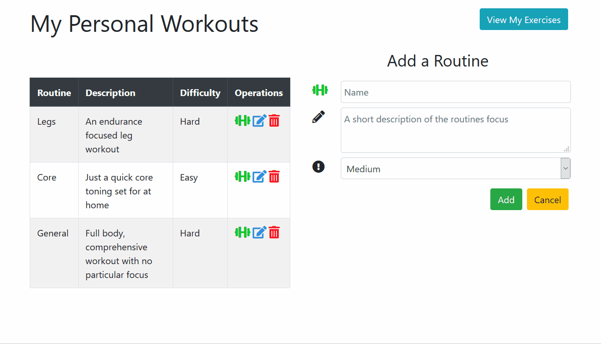

# my-workouts

My Personal Workouts: Written in React

## Introduction

A front end application built with React.js for users to keep track of workout routines

## Technologies Used

- React.js
- Webpack 4
- Bootstrap 4
- CSS3
- HTML5
- AWS EC2

## Live Demo

Try the application live at [my portfolio website](https://my-workouts.kierantallingerdevwork.com)

## Features

- User can view exercises
- User can view if all exercises are complete
- User can add an exercise
- User can update an exercise
- User can delete an exercise

## Preview

